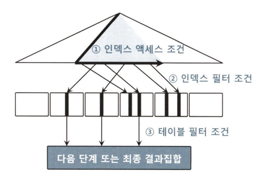

# 7장. SQL 옵티마이저

## 7.1 통계정보와 비용 계산 원리
### 7.1.1 선택도와 카디널리티
* 선택도(Selectivity)
  - 전체 레코드 중에서 조건절에 의해 선택되는 레코드 비율
  - NDV(Number of Distinct Values): 컬럼 값 종류 개수
  - = 1 / NDV

* 카디널리티(Cardinality)
  - 전체 레코드 중에서 조건절에 의해 선택되는 레코드 개수
  - = 총 로우 수 x 선택도 = 총 로우 수 / NDV
* 선택도, 카디널리티 예제
  - 상품분류 컬럼이 '가전', '의류', '식음료', '생활용품', 총 로우수 10만건
  - 선택도 = 1/4 = 25%
  - 카디널리티 = 10만건 x 0.25 = 2만 5천건
* 카디널리티의 이중적 의미:
  - 통계 정보로서의 카디널리티 (Column Cardinality)
    - 컬럼의 고유값 개수 (NDV)
    - 4개 → "카디널리티가 낮다"
    - 10만개 → "카디널리티가 높다"
  - 실행 계획에서의 카디널리티 (Row Cardinality)
    - 특정 연산의 예상 반환 로우 수
    - 100건 → "카디널리티가 낮다"
    - 10만건 → "카디널리티가 높다"
* NDV를 정확하게 구하는 것이 중요
  - 통계정보 수집주기, 샘플링 비율 등을 잘 결정해야함

### 7.1.2 통계정보
* 오브젝트 통계
  - 테이블 통계
    - 수집 PL/SQL
      ```SQL
      begin
        dbms_stats.gather_table_stats('scott', 'emp');
      end;
      /
      ```
    - 항목
      - NUM_ROWS : 테이블에 저장된 총 레코드 개수
      - BLOCKS : 테이블 블록 수
      - AVG_ROW_LEN : 레코드당 평균 길이
      - SAMPLE_SIZE : 샘플링한 레코드 수
      - LAST_ANALYZED : 통계정보 수집일시
    - 조회 쿼리
      ```SQL
      select num_rows, blocks, avg_row_len, sample_size, last_analyzed
      from all_tables
      where owner = 'SCOTT'
      and table_name = 'EMP';
      ```

  - 인덱스 통계
    - 수집 PL/SQL
      ```SQL
      -- 인덱스 통계만 수집
      begin 
        dbms_stats.gather_index_stats ( ownname => 'scott', indname => 'emp_x01');
      end;
      /

      -- 테이블 통계 + 인덱스 통계
      begin
        dbms_stats.gather_table_stats('scott', 'emp', cascade=>true);
      end;
      /
      ```
    - 항목
      - BLEVEL : 인덱스 루트에서 리프 블록에 도달하기 전까지 읽게되는 블록 수
      - LEAF_BLOCKS : 인덱스 리프 블록 총 개수
      - NUM_ROWS : 인덱스에 저장된 레코드 개수
      - DISTINCT_KEYS : 인덱스 키값의 조합으로 만들어지는 값의 종류 개수
      - AVG_LEAF_BLOCKS_PER_KEY : 인덱스 키값을 모두 '=' 조건으로 조회할 때 읽게 될 리프 블록 개수
      - AVG_DATA_BLOCKS_PER_KEY : 인덱스 키값을 모두 '=' 조건으로 조회할 때 읽게 될 테이블 블록 개수
      - CLUSTERING_FACTOR : 인덱스 키값 기준으로 테이블 데이터가 모여 있는 정도
    - 조회 쿼리
      ```sql
      select blevel, leaf_blocks, num_rows, distinct_keys
          , avg_leaf_blocks_per_key, avg_data_blocks_per_key, clustering_factor
          , sample_size, last_analyzed
      from all_indexes
      where owner = 'SCOTT'
      and table_name = 'EMP'
      and index_name = 'EMP_X01'
      ```
  - 컬럼 통계
    - 테이블 통계 수집할 때 함께 수집
    - 항목
      - NUM_DISTINCT : 컬럼 값의 종류 개수(NDV)
      - DENSITY : '='조건으로 검색할 때의 선택도를 미리 구해 놓은 값
      - AVG_COL_LEN : 컬럼 평균 길이
      - LOW_VALUE : 최소 값
      - HIGH_VALUE : 최대 값
      - NUM_NULLS : 값이 NULL인 레코드 수
    - 조회 쿼리
      ```sql
      select num_distinct, density, avg_col_len, low_value, high_value, num_nulls
          , last_analyzed, sample_size
      from all_tab_columns
      where owner = 'SCOTT'
      and table_name = 'EMP'
      and column_name = 'DEPTNO';
      ```
  - 컬럼 히스토그램
    - 데이터 분포가 균일할 경우 컬럼 통계의 DENSITY를 사용하면 됨
    - 데이터 분포가 불균형할 경우를 대비하여 **히스토그램** 활용
    - 히스토그램 유형
      - 도수분포(FREQUENCY) : 값별로 빈도수 저장
      - 높이균형(HEIGHT-BALANCED) : 각 버킷의 높이가 동일하도록 데이터 분포 관리
      - 상위도수분포(TOP-FREEQUENCY) : 많은 레코드를 가진 사우이 n개 값에 대한 빈도수 저장
      - 하이브리드(HYBRID) : 도수분포와 높이균형 히스토그램의 특성 결합
    - 수집 쿼리
      ```SQL
      -- ename 컬럼: 10개 버킷의 히스토그램 생성
      -- deptno 컬럼: 4개 버킷의 히스토그램 생성
      begin
        dbms_stats.gather_table_stats('scott', 'emp'
        , cascade=>false, method_opt=>'for columns ename size 10, deptno size 4');
      end;
      /

      -- 모든 컬럼에 대해 75개 버킷의 히스토그램 생성
      begin
        dbms_stats.gather_table_stats('scott', 'emp'
        , cascade=>false, method_opt=>'for all columns size 75');
      end;
      /

      -- 모든 컬럼에 대해 Oracle이 자동으로 히스토그램 크기를 결정
      begin
        dbms_stats.gather_table_stats('scott', 'emp'
        , cascade=>false, method_opt=>'for all columns size auto');
      end;
      /
      ```
    - 조회 쿼리
      ```SQL
      select endpoint_value, endpoint_number
      from all_histograms
      where owner = 'SCOTT'
      and table_name = 'EMP'
      and column_name = 'DEPTNO'
      order by endpoint_value;
      ```
* 시스템 통계
  - 애플리케이션 및 하드웨어 성능 특성을 측정
  - 항목
    - CPU 속도
    - 평균적인 Single Block I/O 속도
    - 평균적인 Multiblock I/O 속도
    - 평균적인 Multiblock I/O 개수
    - I/O 서비시스템의 최대 처리량(Throughput)
    - 병렬 Slave의 평균적인 처리량(Throughput)
  - 조회 쿼리
    ```SQL
    select sname, pname, pval1, pval2
    from sys.aux_stats$;
    ```

### 7.1.3 비용 계산 원리
* 인덱스 키 값을 모두 '=' 조건으로 검색할 때
  ```
  비용 = BLEVEL                     -- 인덱스 수직적 탐색 비용
        + AVG_LEAF_BLOCKS_PER_KEY  -- 인덱스 수평적 탐색 비용
        + AVG_DATA_BLOCKS_PER_KEY  -- 테이블 랜덤 액세스 비용
  ```
* 인덱스 키 값이 모두 '=' 조건이 아닐 때
  ```
  비용 = BLEVEL                                 -- 인덱스 수직적 탐색 비용
        + LEAF_BLOCKS x 유효 인덱스 선택도        -- 인덱스 수평적 탐색 비용
        + CLUSTERING_FACTOR x 유효 테이블 선택도  -- 테이블 랜덤 액세스 비용
  ```
* 유효 선택도
  
  - 유효 인덱스 선택도
    - 전체 인덱스 레코드 중 액세스 조건에 의해 선택될 것으로 예상되는 레코드 비중
    - 1번 인덱스 액세스 조건에 의한 선택도
  - 유효 테이블 선택도
    - 전체 인덱스 레코드 중 인덱스 컬럼에 대한 모든 조건절에 의해 선택될 것으로 예상되는 레코드 비중
    - 1,2번 조건에 의한 선택도

## 7.2 옵티마이저에 대한 이해
### 7.1.2 옵티마이저 종류
* 규칙기반(Rule-Based) 옵티마이저(RBO)
  -우선순위 규칙에 따라 실행계획을 만듬
* 비용기반(Cost-Based) 옵티마이저(CBO)
  - 데이터량, 컬럼 값의 수, 컬럼 값 분포, 인덱스 높이, 클러스터링 팩터 등 활용
* CBO만 지원
### 7.2.2 옵티마이저 모드
* ALL_ROWS
  - 전체 처리속도 최적화
* FIRST_ROWS
  - 최초 응답속도 최적화
* FIRST_ROWS_N
  - 최초 N건 응답속도 최적화
* FIRST_ROWS 선택시(ALL_ROWS와 비교)
  - Table Full Scan보다 인덱스를 더 많이 선택
  - 해시 조인, 소트 머지 조인보다 NL 조인 선택
* FIRST_ROWS는 deprecated 되었으므로 FIRST_ROWS_N 사용
  - 읽을 데이터 건수를 지정하므로 정확한 비용 사전 가능
### 7.2.3 옵티마이저에 영향을 미치는 요소
* SQL과 연산자 형태
* 인덱스, IOT, 클러스터, 파티션, MV 등 옵티마이징 팩터
* 제약 설정
* 통계정보
* 옵티마이저 힌트
* 옵티마이저 관련 파라미터

### 7.2.4 옵티마이저의 한계
* 필요한 만큼 충분한 통계정보 확보 불가
* 바인드 변수를 사용한 SQL에 컬럼 히스토그램을 활용할 수 없음
### 7.2.5 개발자의 역할
* 개발자 스스로 옵티마이저가 되어야 함
* 개발자 할 일
  - 필요한 최소 블록만 읽도록 쿼리 작성
    - 함수 호출, 조인 등을 불필요한 칼럼에 적용하지 않도록 주의
  - 최적의 옵티마이징 팩터 제공
    - SQL 조건절을 기준으로 전략적인 인덱스 구성
    - 파티션, 클러스터, IOT 등 DBMS가 제공하는 다양한 기능 활용
    - 적절한 옵티마이저 모드 설정
    - 정확하고 안정적인 통계 정보 수집
  - 옵티마이저 힌트를 사용해 최적의 액세스 경로 유도
    - 필요한 경우에는 힌트 명시
### 7.2.6 튜닝 전문가 되는 공부방법
* 데이터베이스 튜닝(DBMS 성능 튜닝)
  - 정의 : SQL이 병목이나 지연 없이 빠르고 안정적으로 수행되도록 조치하는 모든 활동
  - SQL 튜닝
    - I/O 최적화, DB Call 최적화, SQL 파싱 최적화 등
  - DB 설계
    - 논리적 데이터 구조 설계, 물리적 저장 구조 설계 등
  - 인스턴스 튜닝
    - Lock/Latch 모니터링 및 해소, 메모리 설정, 프로세스 설정 등
* 튜닝 공부 방법
  - 옵티마이저가 SQL을 파싱하고 통계정보를 활용해 실행계획을 생성하는 원리
  - 옵티마이저 쿼리변환 원리를 바탕으로 실행계획을 분석하는 방법
  - 옵티마이저 힌트를 이용해 실행계획을 제어하는 방법
  - 옵티마이저가 좋은 실행계획을 생성하도록 유도하기 위한 효과적인 SQL 작성법
  - 애플리케이션에서 SQL을 실행할 때 사용하는 프로그래밍 인터페이스
  - SQL을 빠르게 처리할 수 있는 좋은 데이터 구조와 파티션/인덱스 설계
  - 정확성과 안정성을 확보할 수 있는 통계정보 수집 정책
* **DBMS를 움직이게 하는 소스인 SQL과 좋은 데이터 구조를 설계하는 것에 관심을 두자**